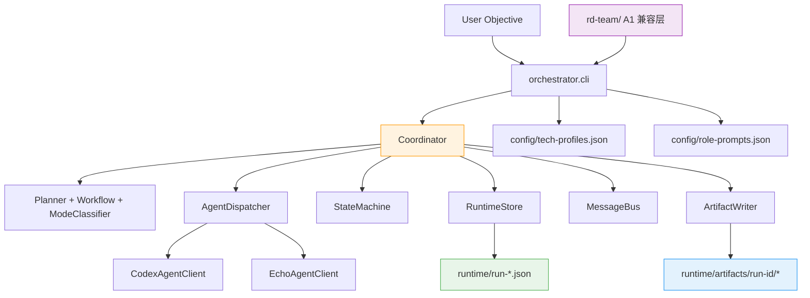
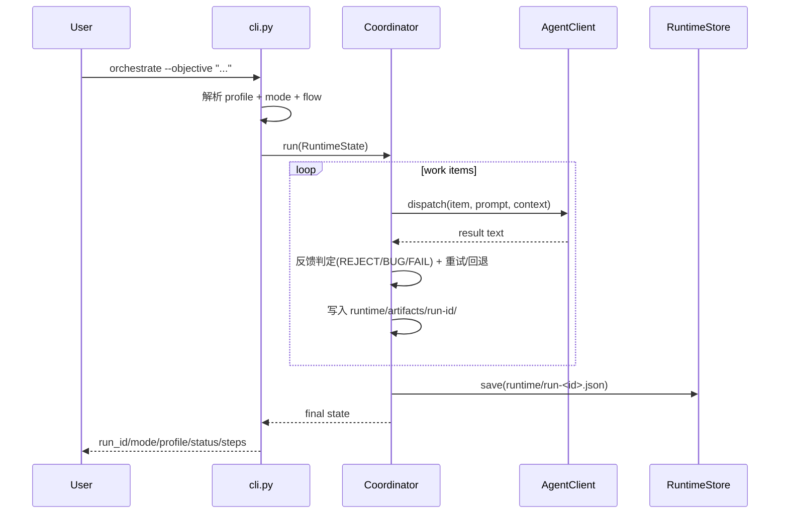
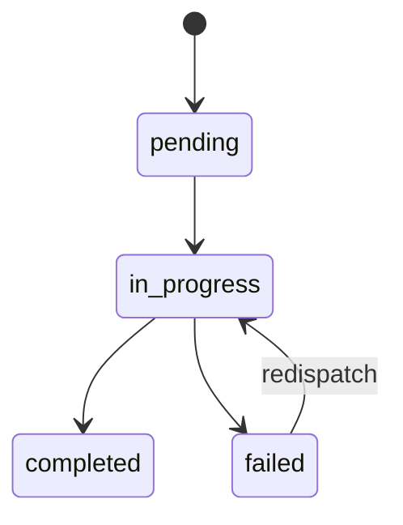

# Architecture

本文描述 `codex-ai-rd-team` 的运行架构：  
**Python 编排内核（唯一执行真相） + A1 兼容层（入口与资源适配）**。

---

## 1. 设计目标

- **单一执行内核**：编排逻辑只在 `orchestrator/` 实现，避免双实现漂移。
- **模式驱动**：根据 objective 自动选择 `new_project/feature/bugfix/refactor`。
- **角色闭环**：reviewer/tester 可触发重试，最终进入 `completed/failed/needs_user_decision`。
- **运行可追溯**：状态、消息、执行产物按 run 隔离落盘。
- **兼容可扩展**：A1 目录保持兼容，不复制内核算法。

---

## 2. 系统分层与边界



---

## 3. 核心执行流



---

## 4. 模式与角色流

`orchestrator/workflow.py`

| 模式 | 角色流（`has_frontend=false`） | 角色流（`has_frontend=true`） |
|------|-------------------------------|------------------------------|
| `new_project` | analyst → architect → backend-dev → reviewer → tester | analyst → architect → backend-dev → frontend-dev → reviewer → tester |
| `feature` | analyst → architect → backend-dev → reviewer → tester | analyst → architect → backend-dev → frontend-dev → reviewer → tester |
| `bugfix` | backend-dev → reviewer → tester | backend-dev → reviewer → tester |
| `refactor` | architect → backend-dev → reviewer → tester | architect → backend-dev → frontend-dev → reviewer → tester |

> 实际执行项由 `planner.py` 基于 `role_focus` 生成，再按上述角色流重排。

---

## 5. 状态机与恢复策略

### 5.1 WorkItem 状态迁移



### 5.2 反馈闭环

- `code-reviewer` 首行 `REJECT:` → 当前项回到 `pending`（最多重试 2 次）
- `tester` 首行 `BUG:` / `FAIL:` → 当前项回到 `pending`（最多重试 2 次）
- 超过阈值：`needs_user_decision`

### 5.3 心跳超时

- 若 `message_bus` 检测到超时，触发重派并累加 attempts
- 超过 `max_redispatch`：状态置 `failed` 并终止

---

## 6. 产物策略（混合模式）

### 稳定文档（人工维护）
- `README.md`
- `QUICKSTART.md`
- `ARCHITECTURE.md`
- `docs/` 下设计与规范文档

### 运行产物（自动生成）
- 运行态快照：`runtime/run-*.json`
- 执行产物：`runtime/artifacts/<run_id>/`
  - `requirements/prd.md`
  - `design/architecture.md`
  - `design/api-contracts.md`
  - `reviews/review-{N}.md`

---

## 7. 扩展点

- **新增 profile**：修改 `config/tech-profiles.json`
- **新增角色提示词**：修改 `config/role-prompts.json`
- **新增角色链规则**：修改 `orchestrator/workflow.py`
- **切换执行后端**：实现新 AgentClient 并接入 `agent_dispatcher.py`

---

## 8. A1 兼容层边界

`rd-team/` 仅负责兼容目录与入口语义。  
`rd-team/commands/rd-team.md` 明确转调：

```bash
python -m orchestrator.cli orchestrate --objective "<用户输入>"
```

兼容层不重复实现编排算法，保证内核唯一真相。
